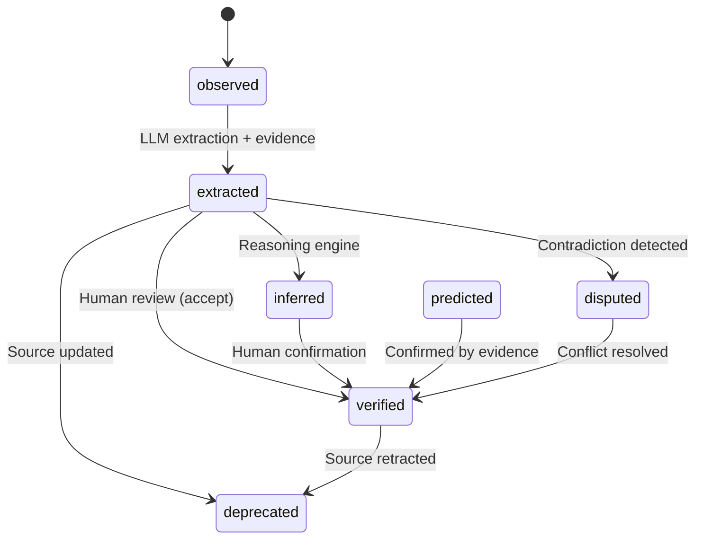

# Epistemic model

riverbank's epistemic model goes beyond simple confidence scores. It tracks how much to trust each fact, why, and what's explicitly missing.

## The nine epistemic status values

Every compiled fact carries a `pgc:epistemicStatus` property. The nine values represent a complete lifecycle from raw observation to validated knowledge:

| Status | Meaning | Assigned when |
|--------|---------|---------------|
| `observed` | Raw observation from source text | Initial extraction before confidence scoring |
| `extracted` | Machine-extracted with confidence score | After LLM extraction with evidence |
| `inferred` | Derived via reasoning (OWL, Datalog) | pg-ripple inference engine produces new facts |
| `verified` | Human-reviewed and accepted | Label Studio reviewer accepts the extraction |
| `deprecated` | Previously valid, now superseded | Source updated; old fact invalidated |
| `normative` | Prescribed by policy or standard | Extracted from normative/regulatory text |
| `predicted` | Model prediction, not yet confirmed | Ensemble prediction below verification threshold |
| `disputed` | Multiple sources disagree | `explain-conflict` detects contradictions |
| `speculative` | Hypothetical or uncertain claim | Extracted from hedged language ("might", "could") |

### How statuses flow



### Querying by status

```sparql
SELECT ?s ?p ?o ?status
WHERE {
  ?s ?p ?o .
  ?s pgc:epistemicStatus ?status .
  FILTER(?status = "verified")
}
```

### Status in RAG context

When `rag_context()` formats graph facts into LLM prompts, it includes the epistemic status. This allows downstream models to weight verified facts higher than speculative ones.

## Negative knowledge

Recording what is explicitly **not** present is as important as recording what is. `pgc:NegativeKnowledge` represents a deliberate absence — "we looked for X and confirmed it does not exist in the source."

### Why this matters

Without negative knowledge:

- "No error-handling path found" is indistinguishable from "we didn't look"
- A query for error-handling paths returns empty — is that correct or incomplete?

With negative knowledge:

- The absence is recorded explicitly with a reason
- Queries can distinguish "confirmed absent" from "not yet extracted"

### Structure

```turtle
_:nk1 a pgc:NegativeKnowledge ;
    pgc:aboutSubject <http://example.org/step/3> ;
    pgc:negatedPredicate <http://procedural-knowledge.example/hasErrorHandlingPath> ;
    pgc:reason "No error-handling path was found for this procedure step." ;
    pgc:fromFragment <http://example.org/fragment/runbook-deploy#step3> ;
    pgc:compiledAt "2024-12-01T10:30:00Z"^^xsd:dateTime .
```

### Absence rules in profiles

The `absence_rules` field in a compiler profile automatically generates negative knowledge when a predicate is expected but not found:

```yaml
absence_rules:
  - predicate: "http://procedural-knowledge.example/hasErrorHandlingPath"
    summary: "No error-handling path was found for this procedure step."
```

## Argument graphs

`pgc:ArgumentRecord` captures structured arguments for or against a claim:

```turtle
_:arg1 a pgc:ArgumentRecord ;
    pgc:claim <http://example.org/fact/acme-founded-1995> ;
    pgc:evidence <http://example.org/fragment/history#p3> ;
    pgc:objection "Company registry shows 1997" ;
    pgc:rebuttal "Registry date is incorporation, not founding" ;
    pgc:strength 0.75 .
```

### Structure

| Property | Purpose |
|----------|---------|
| `pgc:claim` | The fact being argued about |
| `pgc:evidence` | Fragment supporting the claim |
| `pgc:objection` | Counter-argument text |
| `pgc:rebuttal` | Response to the objection |
| `pgc:strength` | Argument strength `[0.0, 1.0]` |

Argument graphs enable the `riverbank explain-conflict` command to show not just what contradicts, but why, and how the contradiction might be resolved.

## Assumption registry

`pgc:AssumptionRecord` records explicit assumptions made during compilation:

```turtle
_:asn1 a pgc:AssumptionRecord ;
    pgc:assumptionText "All dates in source are UTC" ;
    pgc:scope <http://example.org/source/timezones.md> ;
    pgc:impact "Date comparisons may be incorrect if local times are used" ;
    pgc:status "active" .
```

Assumptions are tracked so that when an assumption is invalidated (e.g., you discover dates are actually local time), you can find all facts that depended on it.

## Coverage maps

`pgc:CoverageMap` tracks which concepts have been extracted and which remain unaddressed:

- Compiled concepts with high confidence → covered
- Compiled concepts with low confidence → partially covered
- Concepts mentioned in competency questions but absent from the graph → uncovered

Query coverage:

```sparql
SELECT ?concept ?coverage
WHERE {
  ?cm a pgc:CoverageMap ;
      pgc:concept ?concept ;
      pgc:coverageLevel ?coverage .
}
```
