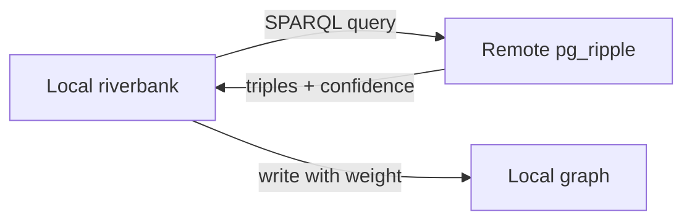

# Federation

Federation enables riverbank instances to pull triples from remote pg-ripple endpoints, creating a distributed knowledge graph where each node maintains its own compiled corpus but can enrich its graph with facts from peers.

## How it works



1. Register a remote endpoint with its SPARQL URL and confidence weight
2. Run `riverbank federation compile` to pull triples
3. Remote triples are written to the local graph with adjusted confidence (multiplied by the endpoint's weight)

## Register an endpoint

```bash
riverbank federation register peer-alpha https://peer.example.com/sparql \
  --weight 0.8 \
  --timeout 30
```

The `--weight` parameter (0.0–1.0) controls how much to trust facts from this peer. A weight of 0.8 means remote facts arrive at 80% of their original confidence.

## Compile from a peer

```bash
riverbank federation compile peer-alpha --limit 500
```

This fetches up to 500 triples from the remote endpoint and writes them to the local trusted graph with provenance edges indicating the remote source.

## Confidence weighting

If a remote triple has confidence 0.9 and the endpoint weight is 0.8:

- Local confidence = 0.9 × 0.8 = 0.72

This ensures remote facts are treated with appropriate skepticism. Facts that fall below the local profile's confidence threshold are routed to the draft graph.

## Use cases

- **Team-level compilation** — each team compiles their own corpus, then federates shared concepts
- **Cross-domain enrichment** — a security team's compiled threat intelligence enriches the platform team's runbook knowledge
- **Hierarchical compilation** — leaf nodes compile raw documents, parent nodes federate and deduplicate

## Limitations

- Federation is pull-based (not real-time sync)
- The remote endpoint must expose a SPARQL interface (pg-ripple)
- Entity deduplication across federated sources relies on `pg_ripple.suggest_sameas()`
