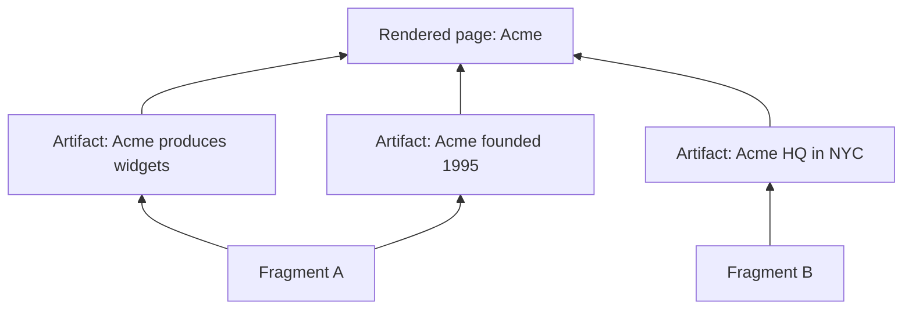

# Fragment and artifact model

riverbank's data model has two core entities: **fragments** (units of source content) and **artifacts** (compiled knowledge derived from fragments).

## Fragments

A fragment is a stable section of a source document — typically one heading and its content. Fragments are the unit of compilation: each fragment is independently extractable, hashable, and cacheable.

```
Source document
├── Fragment A (## Introduction)
├── Fragment B (## Architecture)
└── Fragment C (## Deployment)
```

### Fragment properties

| Property | Type | Purpose |
|----------|------|---------|
| `id` | UUID | Internal primary key |
| `source_id` | FK | Reference to parent source |
| `fragment_key` | string | Stable heading path (e.g., `## Architecture`) |
| `content_hash` | bytes | `xxh3_128` of fragment text — enables skip logic |
| `char_start` | int | Start offset in source document |
| `char_end` | int | End offset in source document |
| `tenant_id` | string | Tenant scope (nullable) |

### Hash-based skip logic

The content hash is the foundation of incremental compilation:

1. On ingest, compute `xxh3_128(fragment_text)`
2. Compare to stored hash from previous run
3. If identical → skip (zero LLM cost)
4. If different → recompile this fragment

## Artifacts

An artifact is a compiled fact (an RDF triple) written to the knowledge graph. Each artifact traces back to its source fragment via provenance edges.

### Artifact properties (in the graph)

| Property | Type | Purpose |
|----------|------|---------|
| Subject IRI | URI | The entity or concept |
| Predicate | URI | The relationship |
| Object | URI or literal | The value |
| `pgc:confidence` | float | Extraction confidence `[0.0, 1.0]` |
| `pgc:fromFragment` | URI | Source fragment reference |
| `pgc:byProfile` | URI | Compiler profile used |
| `pgc:compiledAt` | dateTime | When this fact was compiled |
| `pgc:epistemicStatus` | string | Epistemic status tag |
| `pgc:evidenceSpan` | JSON | Character range + excerpt |

## The dependency graph

The `_riverbank.artifact_deps` table records edges between artifacts and their dependencies:



When Fragment A changes:
- Artifacts A1 and A2 are invalidated
- The rendered page for Acme is marked stale
- Fragment B and Artifact A3 are untouched

## Named graphs

Artifacts live in named graphs that separate concerns:

| Graph | Contents |
|-------|----------|
| `<trusted>` | High-confidence facts (above threshold) |
| `<draft>` | Low-confidence facts pending review |
| `<vocab>` | SKOS concepts from the vocabulary pass |
| `<human-review>` | Corrections from Label Studio |

Multi-tenant deployments use per-tenant graph prefixes (e.g., `<http://riverbank.example/graph/acme/trusted>`).
