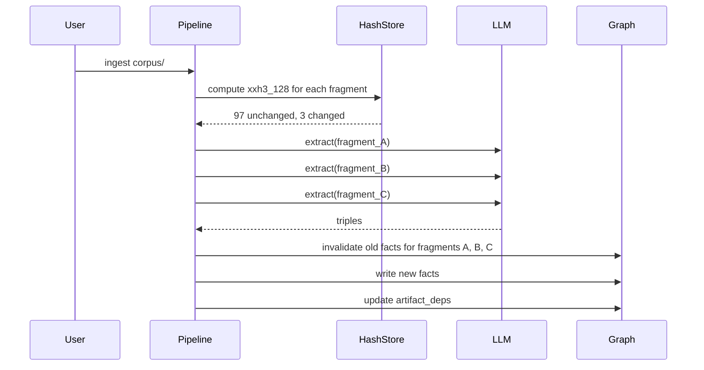

# Incremental compilation

Incremental compilation is what makes riverbank suitable for living corpora that change continuously. When one paragraph in one document changes, only the knowledge derived from that paragraph needs recompilation — not the whole corpus.

## How it works



## The three layers

### 1. Fragment-level hash skip

Each fragment's `xxh3_128` hash is stored after compilation. On re-ingest:

- Same hash → skip entirely (zero cost)
- Different hash → recompile

This is O(1) per fragment — just a hash comparison, no LLM call.

### 2. Artifact dependency graph

The `_riverbank.artifact_deps` table records which compiled facts depend on which fragments. When a fragment is recompiled:

1. All artifacts depending on that fragment are invalidated
2. New artifacts from the re-extraction replace them
3. Downstream dependents (rendered pages, coverage maps) are marked stale

### 3. Semantic diff events via pg-trickle

When compiled knowledge changes, pg-trickle's differential dataflow computes the semantic diff (which triples were added, removed, or modified). pg-tide delivers these diff events to downstream systems via Kafka, NATS, Redis Streams, or HTTP webhooks.

## Cost model

For a corpus of 1000 fragments where 3 changed:

| Without incremental compilation | With incremental compilation |
|------|------|
| 1000 LLM calls | 3 LLM calls |
| Full SHACL revalidation | 3 fragment revalidations |
| All quality scores recomputed | Scores update incrementally (pg-trickle IMMEDIATE mode) |

## The artifact dependency table

```sql
CREATE TABLE _riverbank.artifact_deps (
    artifact_iri    TEXT NOT NULL,
    dep_kind        TEXT NOT NULL,  -- 'fragment', 'profile', 'run'
    dep_ref         TEXT NOT NULL,
    created_at      TIMESTAMPTZ DEFAULT now()
);
```

Query it with `riverbank explain`:

```bash
riverbank explain http://example.org/entity/Acme
```

## SHACL scores stay current

pg-trickle's `IMMEDIATE` refresh mode keeps SHACL score gates in sync within the same transaction as the graph write. The ingest gate decision is always based on current state — not a stale snapshot from the last full recomputation.

## Rendered page staleness

Rendered pages (`pgc:RenderedPage`) carry dependency edges to their source facts. When those facts change, the page is stale and can be regenerated:

```bash
riverbank render http://example.org/entity/Acme --format markdown
```
