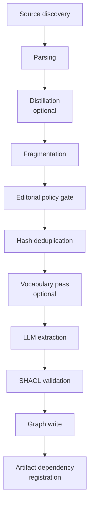

# Pipeline stages

The riverbank compilation pipeline transforms raw documents into governed knowledge through a sequence of well-defined stages.

## 1. Source discovery

The configured connector discovers documents. The filesystem connector walks a directory tree; custom connectors can pull from APIs, S3, or message queues.

Each discovered file is registered as a `pgc:Source` in `_riverbank.sources` with an IRI, content hash, and optional tenant ID.

## 2. Parsing

The parser converts the raw format into a normalized text representation with heading positions. Parsers are pluggable:

- `markdown` — uses `markdown-it-py`, preserves heading structure
- `docling` — handles PDF, DOCX, HTML via the Docling library

## 3. Distillation (optional)

When `distillation.enabled: true` in the profile, the distillation step runs immediately after parsing and before fragmentation. It selects and compresses extractable content, reducing the token cost of all downstream stages.

Distillation is a **content selection problem**, not raw compression: the step identifies provably non-extractable sections (references, navigation, captions, boilerplate) and removes them deterministically, then applies strategy-specific LLM transformation to the remainder.

**Strategies:**

| Strategy | What it does | LLM calls |
|---|---|---|
| `boilerplate_removal` | Deterministic regex stripper — removes reference sections, footnotes, navigation, captions | 0 |
| `aggressive` | LLM compresses to core facts only (~10 kB) | 1 |
| `moderate` | LLM removes boilerplate, keeps factual sections verbatim (~30 kB, **default**) | 1 |
| `conservative` | LLM removes only navigation, references, and captions (~60–90% of original) | 1 |
| `section_aware` | Two-pass: classify each section by type, then LLM-summarise low-density sections | 1–N |
| `budget_optimized` | Adaptive: estimates triples-per-kB from a sample, selects strategy to hit cost target | 0–1 |

The distilled text replaces the original for all downstream stages. The original `content_hash` is preserved on the `SourceRecord`, so fragment-level deduplication continues to work correctly.

**Caching:** distillation outputs are cached by `xxh3_128(content) + strategy + target_size`. Re-ingesting an unchanged document costs zero additional LLM calls.

See [Use document distillation](../how-to/use-document-distillation.md) for the full profile schema and worked examples.

## 4. Fragmentation

The fragmenter splits parsed content into compilation units. The heading fragmenter creates one fragment per heading section. Each fragment gets:

- A stable `fragment_key` (heading path)
- An `xxh3_128` content hash for change detection
- Character offsets for evidence span validation

## 5. Editorial policy gate

Before LLM extraction (which costs money), the editorial policy filters fragments:

- **`min_fragment_length`** — skip fragments too short to contain useful knowledge
- **`max_fragment_length`** — flag fragments that exceed context window limits
- **`min_heading_depth`** — skip top-level headings that are just titles
- **`allowed_languages`** — skip content in unsupported languages

Skipped fragments are recorded in the run stats, not silently dropped.

## 6. Hash deduplication

Each fragment's `xxh3_128` hash is compared to the stored hash from the previous run. Unchanged fragments are skipped entirely — zero LLM calls for stable content.

This is the core of incremental compilation: re-ingesting a 1000-document corpus where 3 documents changed produces only 3 fragments worth of LLM calls.

## 7. Vocabulary pass (optional)

When `run_mode_sequence` includes `vocabulary`, a first pass extracts `skos:Concept` triples into the `<vocab>` named graph. This establishes canonical entity IRIs before the full extraction pass, so that relationship extraction can reference consistent entities rather than creating duplicates.

## 8. LLM extraction

The extractor sends the fragment text and profile prompt to the configured LLM and parses the response into structured triples. Each triple carries:

- **Subject, predicate, object** — the RDF statement
- **Confidence** — a float in `[0.0, 1.0]`
- **EvidenceSpan** — exact character offsets + verbatim excerpt from the source

The `EvidenceSpan` contract is enforced: the excerpt must match the text at the declared offset. Fabricated citations are rejected.

## 9. SHACL validation

Extracted triples are validated against SHACL shapes:

- Triples meeting the confidence threshold → `trusted` named graph
- Triples below threshold → `draft` named graph (pending review)
- Triples violating shape constraints → rejected with a `pgc:LintFinding`

## 10. Graph write

Valid triples are written to pg-ripple via `load_triples_with_confidence()`. Each carries:

- `prov:wasDerivedFrom` → source fragment
- `pgc:confidence` → extraction confidence
- `pgc:compiledAt` → timestamp
- `pgc:byProfile` → compiler profile reference

## 11. Artifact dependency registration

The artifact dependency graph (`_riverbank.artifact_deps`) records which compiled facts depend on which fragments. This enables:

- **Incremental invalidation** — when a fragment changes, exactly the right facts are recompiled
- **`riverbank explain`** — trace any fact back to its sources
- **Staleness detection** — rendered pages know when their source facts changed
