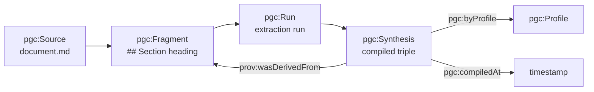

# Provenance model

Every fact in the compiled knowledge graph traces back to the exact character range in the source document it came from. This provenance chain enables trust, auditability, and GDPR compliance.

## The PROV-O chain

riverbank uses the W3C PROV-O vocabulary to record provenance:



### From source to triple

1. **Source** — a registered document (`pgc:Source`)
2. **Fragment** — a section of that document (`pgc:Fragment`), with character offsets
3. **Run** — one compilation attempt (`pgc:Run`), with tokens, cost, and Langfuse trace
4. **Synthesis** — the compiled triple (`pgc:Synthesis` / `pgc:Artifact`)

Each synthesis carries a `prov:wasDerivedFrom` edge pointing to its source fragment.

## Citation grounding (EvidenceSpan)

The `pgc:evidenceSpan` property stores a JSON object:

```json
{
  "char_start": 142,
  "char_end": 198,
  "excerpt": "Acme produces widgets for the enterprise market"
}
```

### Why fabricated citations are impossible

The `EvidenceSpan` contract requires:

1. An exact `char_start` and `char_end` offset
2. A verbatim `excerpt` of the text at that range
3. The pipeline **validates** that `fragment_text[char_start:char_end] == excerpt`

If the excerpt does not match the declared offsets, the extraction is rejected. This makes hallucinated evidence structurally impossible — the type system enforces grounding.

## Querying provenance

### Find the source of a fact

```sparql
SELECT ?source ?fragment ?excerpt
WHERE {
  <http://example.org/entity/Acme> prov:wasDerivedFrom ?fragment .
  ?fragment pgc:fromSource ?source .
  <http://example.org/entity/Acme> pgc:evidenceSpan ?span .
}
```

### Find all facts from a specific document

```sparql
SELECT ?fact ?predicate ?object
WHERE {
  ?fact prov:wasDerivedFrom ?fragment .
  ?fragment pgc:fromSource <http://example.org/source/architecture.md> .
  ?fact ?predicate ?object .
}
```

## GDPR erasure via provenance

The provenance graph enables surgical GDPR compliance. When a source must be erased:

1. Find all fragments derived from the source
2. Find all artifacts derived from those fragments
3. Delete the artifacts, fragments, and source
4. The provenance chain cascades the deletion automatically

```bash
riverbank tenant delete acme --gdpr
```

This follows the `prov:wasDerivedFrom` edges to find and delete all downstream data.

## Audit trail

Every operation (ingest, review, delete) is logged in `_riverbank.audit_log` with:

- Timestamp
- Actor (user or system)
- Operation type
- Affected entity IRIs
- Tenant context

The audit trail is append-only and RLS-protected per tenant.
