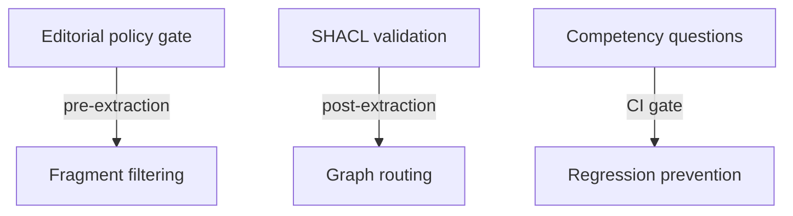

# Quality gates

riverbank enforces quality at multiple levels: before extraction (editorial policy), after extraction (SHACL validation), and in CI (competency questions).

## The three quality layers



## Layer 1: Editorial policy gate

The editorial policy prevents wasted LLM calls on content that won't produce useful knowledge:

| Rule | Effect |
|------|--------|
| `min_fragment_length: 50` | Fragments < 50 chars are skipped |
| `max_fragment_length: 8000` | Fragments > 8000 chars are flagged |
| `min_heading_depth: 0` | Controls which heading levels are extractable |
| `allowed_languages: [en]` | Skips non-matching content |

Skipped fragments appear in the ingest summary as "Fragments skipped (gate)".

## Layer 2: SHACL validation

After extraction, triples are validated against SHACL shapes via `pg_ripple.shacl_score()`:

- **Score ≥ threshold** → triple written to `trusted` named graph
- **Score < threshold** → triple written to `draft` named graph (pending review)
- **Shape violation** → triple rejected, `pgc:LintFinding` recorded

### The ingest gate

The ingest gate is the decision point between trusted and draft graphs. The threshold is set per-profile:

```yaml
editorial_policy:
  confidence_threshold: 0.7
```

### SHACL score function

`pg_ripple.shacl_score()` returns a numeric score for a named graph:

```sql
SELECT pg_ripple.shacl_score('http://riverbank.example/graph/trusted');
-- Returns: 0.9234
```

The score reflects the proportion of triples that conform to all registered SHACL shapes.

### pg-trickle IMMEDIATE mode

SHACL scores are maintained incrementally via pg-trickle. When a triple is written, the score updates within the same transaction — no stale snapshots.

## Layer 3: Competency questions (CI)

Competency questions are SPARQL ASK queries that the compiled graph must satisfy:

```yaml
competency_questions:
  - id: cq-01
    description: "Contains at least one triple"
    sparql: ASK { ?s ?p ?o . }
  - id: cq-02
    description: "Defines the concept 'Confidence'"
    sparql: ASK { ?s ?p "Confidence" . }
```

These are validated in CI via `pytest tests/golden/`. A failing competency question blocks the merge.

## The lint command

`riverbank lint` combines all quality checks:

```bash
# SHACL score only
riverbank lint --shacl-only --threshold 0.7

# SKOS integrity (vocabulary graph)
riverbank lint --layer vocab

# Full lint pass (SHACL + SKOS + pgc:LintFinding triples)
riverbank lint --threshold 0.7
```

Exit code 1 if any check fails — suitable for CI gates.

## Nightly lint flow

The observability module includes a Prefect flow (`run_nightly_lint`) that:

1. Runs `riverbank lint` against all named graphs
2. Records findings as `pgc:LintFinding` triples
3. Updates the `riverbank_shacl_score` Prometheus gauge
4. Alerts if the score drops below threshold
