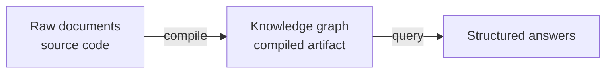

# The compiler analogy

Most systems that feed documents to AI models work by finding the most similar chunks and handing them to the language model at query time. That pattern — retrieval-augmented generation (RAG) — is fast to set up, but it has real limits:

- A chunk loses the context that made it meaningful
- Similarity is not the same as relevance
- Multi-document reasoning is fragile
- The model re-interprets the same raw prose from scratch on every request

riverbank takes a different approach, borrowed from how software compilers work.

## Source code → compiled artifact

A compiler does not run source code directly — it transforms it into a form the machine can execute quickly and reliably. riverbank does the same thing for knowledge:

| Software compiler | Knowledge compiler (riverbank) |
|-------------------|-------------------------------|
| Source code | Raw documents (Markdown, PDF, tickets) |
| Compiler | Ingestion pipeline + LLM extraction |
| Object code | RDF knowledge graph with confidence scores |
| Linker | Entity deduplication + `owl:sameAs` resolution |
| Test suite | Competency questions (SPARQL assertions) |
| Incremental build | Hash-based fragment skip + artifact dependency graph |

## What this buys you

**Incremental maintenance.** When one source document changes, only the knowledge derived from that document needs recompilation — not the whole corpus. Downstream artifacts and quality scores update automatically.

**Quality contracts.** A traditional RAG pipeline has no quality gate. riverbank validates extracted facts against SHACL shapes before they enter the trusted graph. Facts below the confidence threshold go to a draft graph for review.

**Provenance.** Every fact in the compiled graph traces back to the exact character range in the source document it came from. Fabricated citations are rejected at the type-system level.

**Contradiction detection.** Because facts are structured and stored, the system can detect when two sources make contradictory claims — before a user encounters the inconsistency at query time.

## Where the analogy breaks down

The compiler analogy is useful but imperfect:

- **Non-determinism.** LLM extraction is probabilistic. The same source may produce slightly different facts on repeated compilation. Confidence scores quantify this uncertainty; a software compiler has no such ambiguity.
- **No formal semantics for input.** Programming languages have formal grammars. Natural language does not. The "parser" stage is heuristic, not guaranteed.
- **Human judgment required.** Some extractions need human review. The review loop (Label Studio integration) has no analog in traditional compilation.

riverbank embraces these differences rather than hiding them. The epistemic model (confidence scores, negative knowledge, argument graphs) exists precisely because knowledge compilation is harder than code compilation. The system is honest about what it knows, what it doesn't know, and how much to trust each fact.

## The payoff

At query time, you ask structured questions against a compiled artifact — not raw text. The compiler catches contradictions and gaps before they reach users. Every claim traces back to the source fragment it came from. And when a source changes, exactly the right subset of the graph gets recompiled.

This makes riverbank suitable for living corpora that change continuously, not just one-off indexing jobs.
