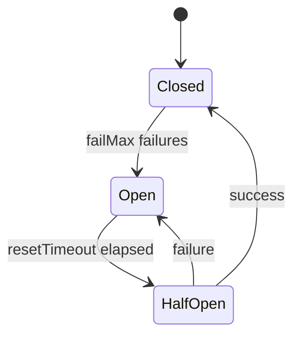

# Circuit breakers

Circuit breakers prevent cascading failures when an LLM provider is degraded or unresponsive.

## States



| State | Behaviour |
|-------|-----------|
| **Closed** | Normal operation — requests pass through |
| **Open** | All requests fail immediately (no LLM call made) |
| **Half-open** | One test request allowed; success → Closed, failure → Open |

## Configuration

Per-provider configuration in the Helm chart:

```yaml
circuitBreakers:
  openai:
    failMax: 5              # Failures before opening
    resetTimeoutSeconds: 60 # Seconds before half-open
    maxConcurrency: 10      # Max parallel LLM calls
  anthropic:
    failMax: 5
    resetTimeoutSeconds: 60
    maxConcurrency: 5
  ollama:
    failMax: 10
    resetTimeoutSeconds: 30
    maxConcurrency: 20
```

## Health check

`riverbank health` reports circuit breaker status:

```
Circuit breakers
  ✓  openai                           closed
  ✓  anthropic                        closed
  ✓  ollama                           closed
```

An open circuit breaker causes `riverbank health` to exit with code 1.

## Impact on ingestion

When a circuit breaker opens:

- All extraction calls to that provider fail immediately
- Fragments that were queued for that provider are recorded as `outcome="error"`
- The worker continues processing fragments that use other providers (if ensemble is configured)
- After `resetTimeoutSeconds`, one test request is attempted

## Monitoring

Watch the circuit breaker state via `riverbank health` or the underlying metrics:

```
riverbank_runs_total{outcome="error",profile="..."}
```

A sudden spike in errors followed by silence indicates an open circuit breaker.

## Recovery

Circuit breakers recover automatically when the provider becomes available again. No manual intervention required. If you need to force-close a breaker (e.g., after a provider incident is resolved), restart the worker pod:

```bash
kubectl rollout restart deployment/riverbank -n riverbank
```
